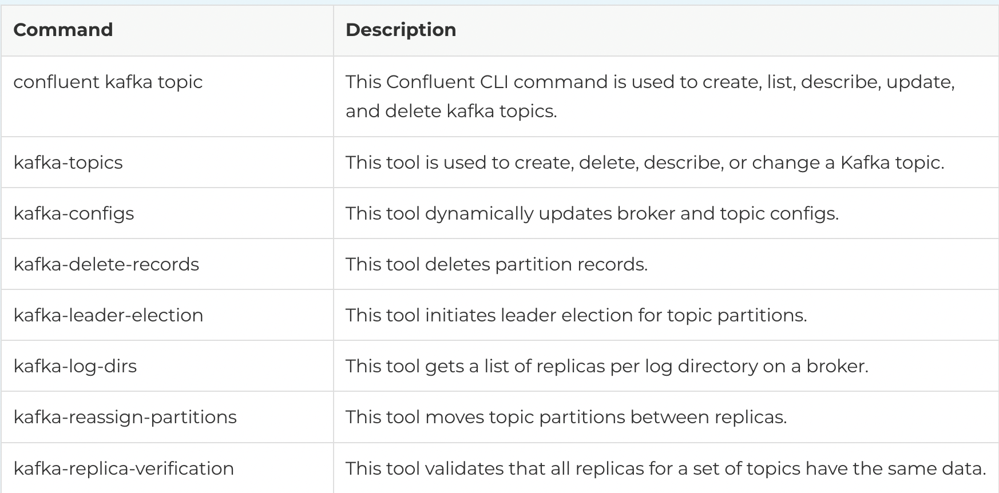

### CLI TOOLS 

#### TOPICS

*LIST*

        kafka-topics \
        --bootstrap-server kafka-1:19092 \
        --topic users \
        --create \
        --replication-factor 3 \
        --partitions 6

*CREATE*

        kafka-topics \
        --bootstrap-server kafka-1:19092 \
        --list

        kafka-topics \
        --bootstrap-server localhost:9092 \
        --describe \
        --topic users | \
        grep "retention.bytes\|segment.bytes\|segment.ms"

*ADD PARTITIONS*

        kafka-topics \
        --bootstrap-server kafka-1:19092 \
        --alter \
        --topic users \
        --partitions 8

        kafka-console-producer \
        --broker-list kafka-1:19092 \
        --topic users

        kafka-console-producer \
        --bootstrap-server kafka-1:19092 \
        --topic users \
        --property parse.key=true \
        --property key.separator=,

*PRODUCE FROM FILE*

        kafka-console-producer \
        --broker-list localhost:9092 \
        --topic  \
        < message.txt

*TOPIC SIZE* 

        kafka-log-dirs \
        --bootstrap-server kafka-1:19092 \
        --describe \
        --topic-list users

*CONSUME WITH KEY*

        kafka-console-consumer \
        --bootstrap-server kafka-1:19092 \
        --topic users \
        --formatter kafka.tools.DefaultMessageFormatter \
        --property print.key=true \
        --property print.value=true

*DISPLAY PARTITIONS OUT OF SYNC*

        kafka-topics \
        --bootstrap-server kafka-1:19092 \
        --describe \
        --under-replicated-partitions

*DESCRIBE ALL*

        kafka-configs --bootstrap-server localhost:9092 \                                                       
        --describe \
        --topic users \
        --all

*PURGE TOPIC*

        kafka-configs \
        --bootstrap-server kafka-1:19092 \
        --alter \
        --topic users \
        --add-config 'retention.ms=1000'

*REMOVE CONFIG*

        kafka-configs \
        --bootstrap-server kafka-1:19092 \
        --alter \
        --topic users \
        --delete-config 'retention.ms'

*DELETE TOPIC*

        kafka-topics \
        --bootstrap-server kafka-1:19092 \
        --delete \
        --topic users

