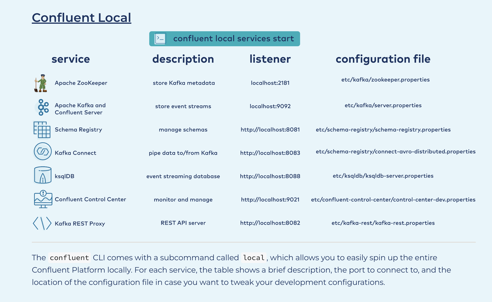

    confluent local services start

** this will output a number `/tmp/confluent.<number>`

    confluent local destroy
    sudo rm -rf /tmp/*

    confluent local services status
    confluent local services kafka log -f

    confluent local services connect connector	            Manage connectors.
    confluent local services connect log	                Print logs showing Connect output.
    confluent local services connect plugin	                Manage Connect plugins.
    confluent local services connect start	                Start Connect.
    confluent local services connect status	                Check if Connect is running.
    confluent local services connect stop	                Stop Connect.
    confluent local services connect top	                View resource usage for Connect.
    confluent local services connect version	            Print the current version of Connect.

_CREATE SCHEMA_

    cat <<EOF > ~/temperature_reading.avsc
    {
    "namespace": "io.confluent.examples",
    "type": "record",
    "name": "temperature_reading",
    "fields": [
    {"name": "city", "type": "string"},
    {"name": "temp", "type": "int", "doc": "temperature in Fahrenheit"} ]
    }
    EOF

_CONSUME_

    confluent local services \
    kafka consume temperatures \
    --property print.key=true \
    --property key.deserializer=org.apache.kafka.common.serialization.StringDeserializer \
    --value-format avro

_PRODUCE_

    confluent local services \
    kafka produce temperatures \
    --property parse.key=true --property key.separator=, \
    --property key.serializer=org.apache.kafka.common.serialization.StringSerializer \
    --value-format avro \
    --property value.schema.file=$HOME/temperature_reading.avsc