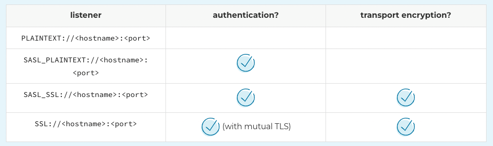
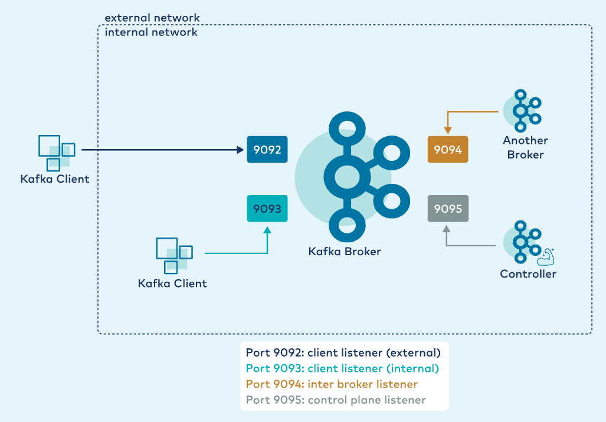

### Simple Authentication and Security Layer (SASL)

#### Available `listener` Protocols 

*Configuring a listener*

    listener.name.<name>.<mechanism>.<property>=<value>

so the config can be defined as:

    listener.name.sasl_plaintext.plain.sasl.jaas.config=org.apache.kafka.common.security.plain.PlainLoginModule required \
    username="kafka" \
    password="kafka-secret" \
    user_client="client-secret";

or as follows: 

    sasl.mechanism = PLAIN
    security.protocol = SASL_PLAINTEXT
    sasl.jaas.config = org.apache.kafka.common.security.plain.PlainLoginModule required \
    username="client" \
    password="client-secret";

*Configure controller-broker communication*

    control.plane.listener.name

#### In Docker

    KAFKA_LISTENERS: CLIENT://kafka-1:9092,BROKER://kafka-1:9094,CONTROLLER://kafka-1:9095
    KAFKA_ADVERTISED_LISTENERS: CLIENT://kafka-1:9092,BROKER://kafka-1:9094,CONTROLLER://kafka-1:9095
    KAFKA_LISTENER_SECURITY_PROTOCOL_MAP: CLIENT:PLAINTEXT,BROKER:SASL_PLAINTEXT,CONTROLLER:SASL_PLAINTEXT
    KAFKA_INTER_BROKER_LISTENER_NAME: BROKER
    KAFKA_SASL_MECHANISM_INTER_BROKER_PROTOCOL: PLAIN
    KAFKA_SASL_ENABLED_MECHANISMS: PLAIN
    KAFKA_LISTENER_NAME_BROKER_PLAIN_SASL_JAAS_CONFIG: |
    org.apache.kafka.common.security.plain.PlainLoginModule required \
    username="kafka" \
    password="kafka-secret" \
    user_kafka="kafka-secret";
    KAFKA_CONTROL_PLANE_LISTENER_NAME: CONTROLLER
    KAFKA_LISTENER_NAME_CONTROLLER_PLAIN_SASL_JAAS_CONFIG: |
    org.apache.kafka.common.security.plain.PlainLoginModule required \
    username="kafka" \
    password="kafka-secret" \
    user_kafka="kafka-secret";

