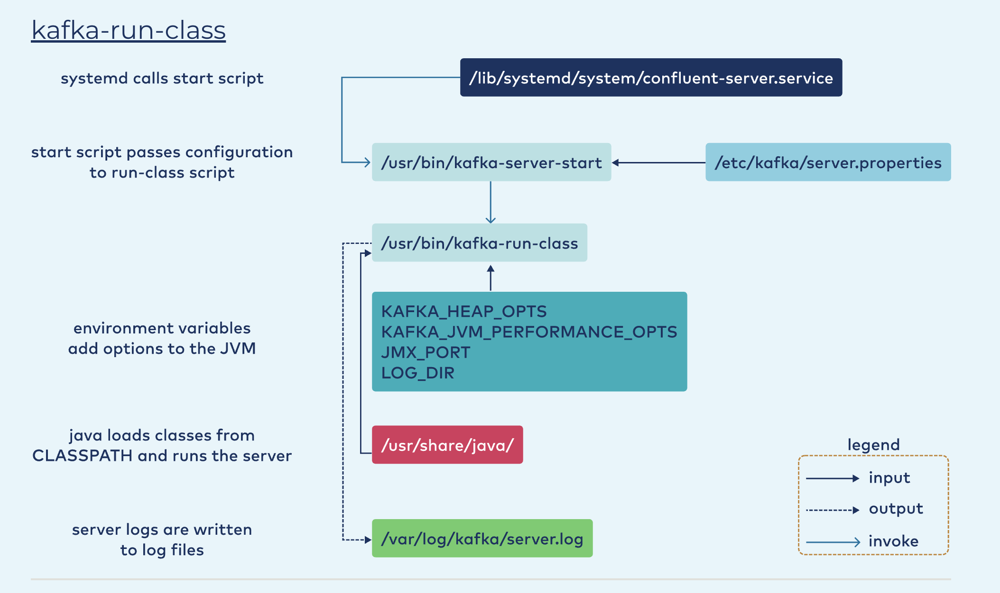

### INSTALL EXAMPLE


    sudo apt-get install openjdk-11-jre-headless

#### TAR
    
        curl -O http://packages.confluent.io/archive/7.1/confluent-7.1.1.tar.gz
        
        tar xzf confluent-7.1.1.tar.gz
        
        export CONFLUENT_HOME=${HOME}/confluent-7.1.1 && echo "export CONFLUENT_HOME=$CONFLUENT_HOME" >> ~/.bashrc
        
        export CONFLUENT_HOME=${HOME}/confluent-7.1.1 && echo "export CONFLUENT_HOME=$CONFLUENT_HOME" >> ~/.zshrc
        
        echo "export PATH=$CONFLUENT_HOME/bin:${PATH}" >> ~/.bashrc
        
        ~/confluent-7.1.1/bin/confluent completion bash | sudo tee /etc/bash_completion.d/confluent \
        && echo "source /etc/bash_completion.d/confluent" >> ~/.bashrc
        
        source ~/.bashrc

### PACKAGE MANAGER

* Add the Confluent apt repository key to the system’s apt keys.

        wget -qO - https://packages.confluent.io/deb/7.1/archive.key | sudo apt-key add -

* Add the Confluent apt repository to the system’s sources, and update package index files.
    
        sudo add-apt-repository \
        "deb [arch=amd64] https://packages.confluent.io/deb/7.1 stable main" && \
        sudo apt-get update

* Install Confluent Platform, including Confluent Server’s enhanced security features.

        sudo apt-get install -y \
        confluent-platform \
        confluent-security

*Interact with systemd Services*

        systemctl cat confluent-server

        sudo systemctl start confluent-zookeeper

        sudo systemctl enable confluent-schema-registry

        sudo systemctl restart confluent-kafka-connect

        sudo systemctl stop confluent-server

        sudo journalctl -f -u confluent-zookeeper --output cat

  * start `confluent-server`

        ```
        while true
        do
            if [[ ! -z $(nc -v -z localhost 2181 2>&1 | grep succeeded) ]]; then
                sudo systemctl start confluent-server
                break
            else
                echo "waiting for zookeeper to be available on port 2181"
                sleep 5
            fi
        done
        ```
        
  * start `confluent-schema-registry`

        ```
        while true
        do
            if [[ ! -z $(nc -v -z localhost 9092 2>&1 | grep succeeded) ]]; then
                sudo systemctl start confluent-schema-registry
                break
             else
                  echo "waiting for kafka to be available on port 9092"
                  sleep 5
            fi
         done
         ```

  * Logging


        sudo journalctl -f -u confluent-server --output cat
        sudo journalctl -n 50 -u confluent-server -o cat

        sudo journalctl -u confluent-server -o cat --since "5 minutes ago" --until "1 minute ago" | grep ERROR

  * Start service with specific file

        control-center-start /etc/confluent-control-center/control-center-dev.properties


#### RUN CLASSES




  * Service unit files

        systemctl cat confluent-control-center
  
  * Main directories:

    `/etc/kafka/` - for properties
    `/usr/bin/` - for scripts

  * Main RUN_CLASS variables

    1. CLASSPATH - `/usr/share/java/`
    
    2. KAFKA_HEAP_OPTS - `KAFKA_HEAP_OPTS="-Xms6g -Xmx6g"` (recommended 4-6 GB)
    
    3. KAFKA_JVM_PERFORMANCE_OPTS - `KAFKA_JVM_PERFORMANCE_OPTS="-XX:MetaspaceSize=96m -XX:+UseG1GC -XX:MaxGCPauseMillis=20 -XX:InitiatingHeapOccupancyPercent=35 -XX:G1HeapRegionSize=16M -XX:MinMetaspaceFreeRatio=50 -XX:MaxMetaspaceFreeRatio=80"`
    
    4. JMX_PORT - `JMX_PORT=9990`
    
    6. JMX_OPTS - `KAFKA_JMX_OPTS="-Dcom.sun.management.jmxremote \ -Djavax.net.ssl.keyStore=</path/to/file>.keystore \ -Djavax.net.ssl.keyStorePassword=<keystore-password> \ -Dcom.sun.management.jmxremote.ssl.need.client.auth=true \ -Djavax.net.ssl.trustStore=</path/to/file>.truststore \ -Djavax.net.ssl.trustStorePassword=<truststore-password> \ -Dcom.sun.management.jmxremote.registry.ssl=true"`
    
    7. KAFKA_OPTS - `KAFKA_OPTS="-Djava.security.auth.login.config=/path/to/my/zookeeper-client.jaas"`
    
    8. LOG_DIR - `LOG_DIR=/var/log/kafka`
    
    9. KAFKA_DEBUG - `KAFKA_DEBUG=true`

  * Customize Environment variable in `systemd`


    sudo mkdir /etc/systemd/system/confluent-server.service.d
    
    cat << EOF | sudo tee /etc/systemd/system/confluent-server.service.d/override.conf
    [Service]
    Environment="KAFKA_HEAP_OPTS=-Xms4g -Xmx4g"
    EOF
    
    sudo systemctl daemon-reload
    
    sudo systemctl start confluent-zookeeper
    
    sudo systemctl start confluent-server
    
    systemctl status confluent-server


