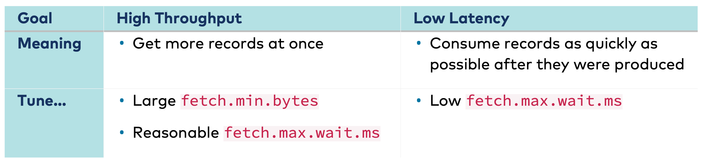

### DATA FETCH

When

    enable.auto.commit=true(default) => the consumer will trigger offset commits as per
    auto.commit.interval.ms=5000ms(default)

#### HOW TO CONTROL DATA FETCH BY CONSUMER
** set for `consumer.properties`

- **Size of data in a fetch**
- **Time to wait for a fetch**

- Tuning data fetch

    fetch.max.wait.ms - 500 ms
    fetch.min.bytes - minimum size of data in a fetch - 1 byte

    max.partition.fetch.bytes - size per partition - 1MB
    max.poll.records - number of records across all partitions - 500 records

#### HOW TO CONTROL DATA FETCH BY FOLLOWER
** set in `server.properties`

    replica.fetch.min.bytes
    replica.fetch.wait.max.ms

#### COMMITTING OFFSETS

When commits are performed manually - both can be combined if needed

    commitAsync() - during normal processing (you can add a callback)
    commitSync() - before closing/rebalance (in “finally” clause)

At most once

    var records=consumer.poll();
    consumer.commitSync();
// process records

At least once

    var records=consumer.poll();
    ... // process records

    consumer.commitSync();

#### TIMEOUTS

    consumer.poll(Duration.ofMillis(100))
    
    consumer.close()
    consumer.close(Duration.ofMillis(100))

### CONSUMER GROUPS AND ASSIGNMENTS

    partition.assignment.strategy = org.apache.kafka.clients.consumer.*RangeAssignor*
    **this value should be the same for all consumers in a group

#### RANGE ASSIGNMENT - default

**default strategy**

Order the partitions by numbers and consumers alphabetically (lexicographically)
P = number of partitions (16)(2)
C = number of consumers (5)(3)
A = floor(P/C) (3)(0)
B = P % C (1)(2)

First B consumers will be assigned A+1 partitions and the rest will be assigned A partitions
So: 4+3+3+3+3+3

_this is calculated for each topic for this consumer group_

#### ROUND ROBIN

**Will put all partitions and consumer in lexicographic order before assigning partitions
** this doesn’t attempt to reduce partitions movement

    partition.assignment.strategy = org.apache.kafka.clients.consumer.*RoundRobinAssignor*

** if your consumer is subscribed to one topic - use this strategy

**There are two types:**

- **Sticky** - will try to minimise partitions movement
- **Cooperative sticky** - same as sticky, but allows the consumers that don’t change assignment to continue consuming

### CONSUMER GROUP MANAGEMENT

Trigger re-balance:

- Number of consumers changed
- Number of partitions changed - can only increase (causes metadata change, which triggers re-balancing)

    heartbeat.interval.ms = 3000
    session.timeout.ms = 45000 => consumer considered dead
    ** was 10 s till kafka 3.0
    max.poll.interval.ms = 5 mins passes without poll => consumer considered dead
    ** this can happen due to long processing or other reasons

Group coordinator thread is running on one of the brokers, this is per group. Group coordinator for another group will run on another broker.

**Re-balancing causes latency!**

To reduce re-balancing time we can use **StickyAssignor** - will randomly give the partition to one of the other consumers

    partition.assignment.strategy = org.apache.kafka.client.consumer.*StickyAssignor*

You can also use **CooperativeSticky**

    partition.assignment.strategy = org.apache.kafka.client.consumer.* CooperativeSticky*

#### STATIC GROUP MEMBERSHIP 

### OFFSET

- Per consumer
- Per partition
** Where to read next

    __consumer_offsets - internal topic, compacted

- Key : group, topic, partition => used to decide partition in the internal topic to write/read the offset
- Value : offset

**Consumers commit their offsets**

    auto.commit.interval.ms=5000 (consumer property)

Offsets are committed on group level

If there isn’t offset committed for group/topic/partition , the following property will be used:

    auto.offset.reset = latest (default) [earliest]

If we don’t want automatic commit:

    enable.auto.commit=false

We can manually commit:

    commitAsync() => doesn’t block, needs a callback
    commitSync() => blocks

**Check out offsets topic**

    kafka-console-consumer --bootstrap-server kafka:9092 \
    --topic __consumer_offsets \
    --formatter "kafka.coordinator.group.GroupMetadataManager\$OffsetsMessageFormatter" | grep 'driver-positions'

