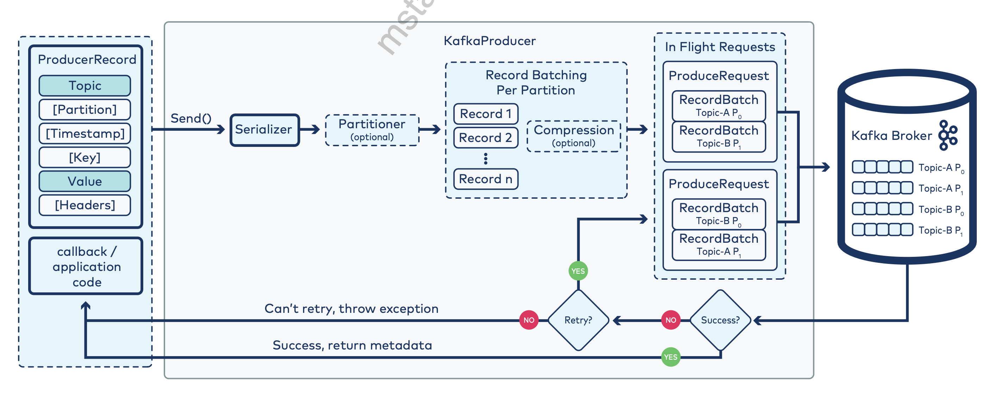

## PRODUCERS

#### MESSAGE SIZES

**producer**

    max.request.size=1MB

### PARTITIONING - partitioning strategy is defined per producer!

- when partition specified
- when there is a key - the partition will be chosen by hash (or custom partitioner)
- when there is no key, it will be sticky partitioner

** Using Partitioner: partitionIndex = hash(key) % numberOfPartitions => this allows to define partition using key

#### STICKY PARTITIONER - default

Messages are accumulated in the first available buffer till batch is formed and then sent to a random partition.
This reduces latency.

#### SEND TO SPECIFIC PARTITION

You can specify a partition when sending the record

_DIFFERENT CLIENTS_

Java client and C library (librdkafka) clients use different hashes, and hence if used on the same topic, the C++ client needs to be re-configured

### TIMESTAMP

If timestamp not provided, the producer will stamp the record with its current time.

Timestamp that will be used depends on topic configuration:

- CreateTime - producer local time
- LogAppendTime - broker local time

#### PRODUCER CLEANUP

- producer.close() => will wait till complete
- producer.close(Duration.ofMillis(..)); => this will either wait till complete or till time expires
** same for consumers

_CLIENTS SUPPORTED BY CONFLUENT_

**JVM**

- Java
- Scala
- Kotlin
- Clojure
- Groovy

**C library** (librdkafka)

- C++
- .NET
- Go
- Python

### SENDING

    linger.ms - how long we wait before flushing the buffer
    ** default = 16384 bytes
    
    batch.size - what size a batch can be when to flush the buffer
    ** default = 0
    
    buffer.memory - max size store in buffer
    ** default 32 MB
    
    max.block.ms - how long producer will wait before send() fails
    ** default = 1 min

#### PERFORMANCE TUNING

    linger.ms = 0
    batch.size = default 16KB
    buffer.memory = default 32MB (size of producer memory for the binary queues)

**High throughput** => large batch+ longer linger or flush manually
**Low latency** => small batch+short linger

If producers are faster than brokers => increase buffer.memory size

#### COMPRESSION

Records can be compressed before sending to broker and decompressed by consumers
** This can compromise latency

Compression algorithms available : none, snappy, gzip, lz4, zstd

#### ACKNOWLEDGMENT

**asks -> producer setting**

- 0 - at most once
- 1 - at least once
- all (-1) - default is exactly once, this requires only followers that are ISR to ack the received message, HENCE we need to set min.in.sync.replicas=2 (at least to 2 !!)

    min.in.sync.replicas -> broker setting (default 1)

#### WAS SEND SUCCESSFUL?

    producer.send().get() -> this will give a result of a Future

Or use a Callback

    producer.send(record, (recordMetadata, e) -> {
            if(e != null)
                e.printStackTrace();
            else
                System.out.println("message string = "+record.value() + ", offset = "+recordMetadata.offset());
        });

### RETRIES AND TIMEOUTS

Best practice to limit delivery with timeouts and not retries

Retries => default = MAX_INT

    request.timeout.ms = default 30 sec

    retry.backoff.ms = default 100 (how much time added after a failed request before retrying)

    delivery.timeout.ms = default 2 mins (upper bound to report success or failure for send())

_use this to control producer retries_

#### IDEMPOTENCE

To enable idempotence:

    max.in.flight.requests.per.connection:  <=5
    retries: >0
    acks: all
    enable.idempotence: true

