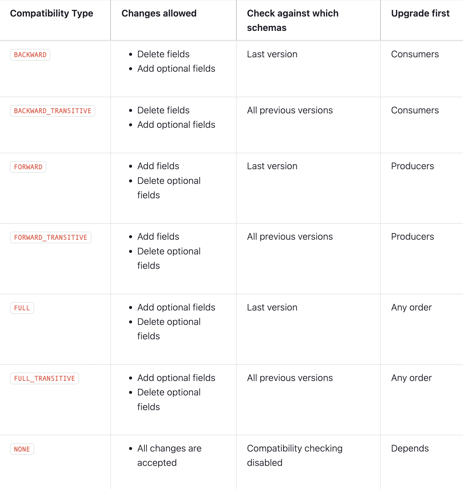

### Compatability

#### Forward compatability

- Code with new version of the schema can read data written in the old schema
- if the new fields are not provided, it will assume default values, and hence when:
    - adding a new fields you must provide default value or make it optional
    - removing fields is fine

#### Backward compatability

- Code with previous (old) schema version can read data written in the new schema
- Code with old schema that reads data written with new schema will ignore the new fields, and hence:
    - adding new fields is fine
    - removing fields - only optional fields can be removed

#### Full compatability

- Both Forward and Backward compatibility are fulfilled

