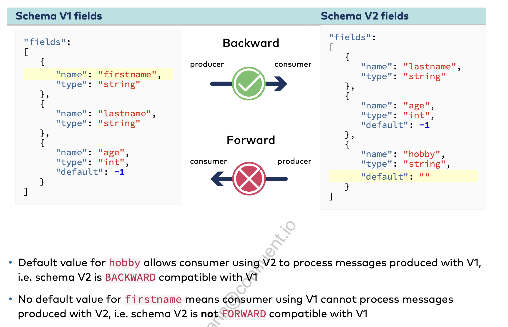

#### Forward compatability

- Code with new version of the schema can read data written in the old schema
- if the new fields are not provided, it will assume default values. And hence when adding a new fields you must provide default value or make it optional

#### Backward compatability

- Code with previous (old) schema version can read data written in the new schema
- Code with old schema that reads data written with new schema will ignore the new fields

#### Full compatability

- Both Forward and Backward compatibility are fulfilled

