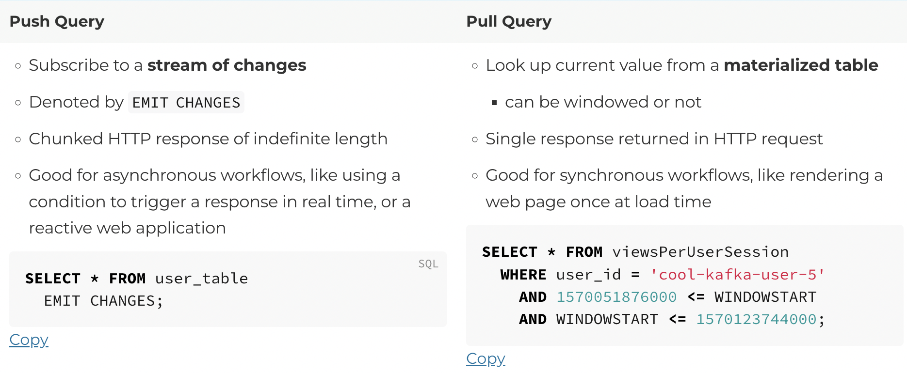
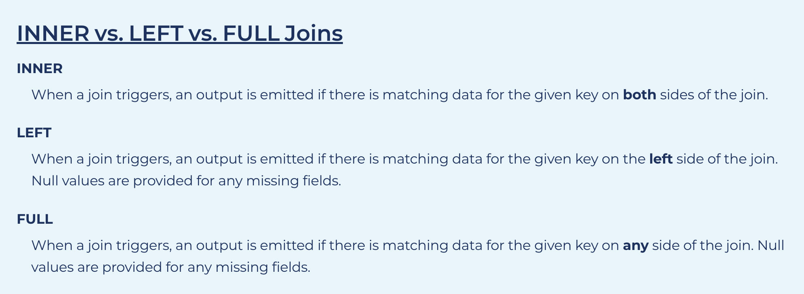
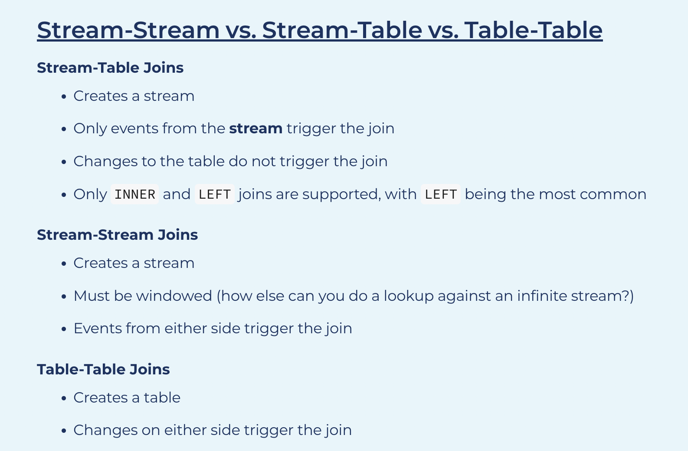

### Some sample queries for ksql and connect

        ``CREATE SOURCE CONNECTOR `stockapp.trades` WITH (
        'connector.class' = 'io.confluent.kafka.connect.datagen.DatagenConnector',
        'kafka.topic' = 'ksqldb.stockapp.trades',
        'quickstart' = 'Stock_Trades',
        'max.interval' = 3000,
        'iterations' = 1000,
        'tasks.max' = '1'
        );
        
        CREATE SOURCE CONNECTOR `stockapp.users` WITH (
        'connector.class' = 'io.confluent.kafka.connect.datagen.DatagenConnector',
        'kafka.topic' = 'ksqldb.stockapp.users',
        'quickstart' = 'Users_',
        'max.interval' = 3000,
        'iterations' = 1000,
        'tasks.max' = '1'
        );

### Push and Pull

        
#### Push queries 

        CREATE TABLE stockapp_users (
        userid STRING PRIMARY KEY,
        registertime BIGINT,
        regionid STRING,
        gender STRING,
        interests ARRAY<STRING>,
        contactinfo MAP<STRING, STRING>
        ) WITH (
        KAFKA_TOPIC = 'ksqldb.stockapp.users',
        VALUE_FORMAT = 'AVRO'
        );``

        CREATE STREAM stockapp_trades
        WITH (
        KAFKA_TOPIC = 'ksqldb.stockapp.trades',
        VALUE_FORMAT = 'AVRO'
        );
        
Perform Continuous Transformations
        
        CREATE STREAM stockapp_trades_transformed AS
        SELECT
        CAST(price AS DECIMAL(7,2)) * quantity / 100 AS dollar_amount,
        MASK(account, '*', '*', NULL, NULL) AS account_masked,
        symbol,
        userid
        FROM stockapp_trades
        WHERE symbol LIKE '%T'
        EMIT CHANGES;

#### Pull queries

        SELECT
        zipcode,
        total_dollars,
        TIMESTAMPTOSTRING(WINDOWSTART, 'yyyy-MM-dd''T''HH:mm:ss.SSS', 'UTC') AS window_start,
        TIMESTAMPTOSTRING(WINDOWEND, 'yyyy-MM-dd''T''HH:mm:ss.SSS', 'UTC') AS window_end
        FROM STOCKAPP_DOLLARS_BY_ZIP_5_MIN
        WHERE zipcode IN ('94403', '92617', '94301', '95112', '94070')
        AND WINDOWSTART >= '2022-08-10T15::00.000'
        AND WINDOWEND <= '2022-08-10T15:10:00.000';

#### Join

        CREATE STREAM joined_stream AS
        SELECT s1.foo, s2.bar
        FROM left_stream s1
        LEFT JOIN right_stream t
        WITHIN 1 HOURS
        ON s1.foo = s2.foo
        EMIT CHANGES;

A new event from the right stream triggers a lookup in the time window.
In this case, there are **two** matching events from the other stream in the window, so two output events will be produced to the output stream.
If the event came from the left stream instead, the lookup would show three matching events from the other side, and thus **three** events would be produced to the output stream.

#### Grace period

        SELECT order_zipcode, TOPK(order_total, 5) FROM orders
        WINDOW TUMBLING (SIZE 1 HOUR, GRACE PERIOD 2 HOURS)
        GROUP BY order_zipcode
        EMIT CHANGES;

#### Retention period

        CREATE TABLE pageviews_per_region AS
        SELECT regionid, COUNT(userid) FROM pageviews
        WINDOW HOPPING (SIZE 30 SECONDS, ADVANCE BY 10 SECONDS, RETENTION 7 DAYS, GRACE PERIOD 30 MINUTES)
        WHERE UCASE(gender)='FEMALE' AND LCASE (regionid) LIKE '%_6'
        GROUP BY regionid
        EMIT CHANGES;

#### Define your own type

        -- create the ADDRESS type
        
        CREATE TYPE ADDRESS AS STRUCT<number INTEGER, street VARCHAR, city VARCHAR>;
        
        -- use the ADDRESS type later on
        
        CREATE STREAM my-stream (
        userid INTEGER KEY,
        email STRING,
        address ADDRESS
        ) WITH (
        KAFKA_TOPIC = 'my-topic',
        VALUE_FORMAT = 'AVRO'
        );

#### Specify timestamp

        CREATE STREAM TEST (id BIGINT KEY, event_timestamp VARCHAR)
        WITH (
        KAFKA_TOPIC ='test_topic',
        VALUE_FORMAT ='JSON',
        TIMESTAMP = 'event_timestamp',
        TIMESTAMP_FORMAT = 'yyyy-MM-dd''T''HH:mm:ssX'
        );